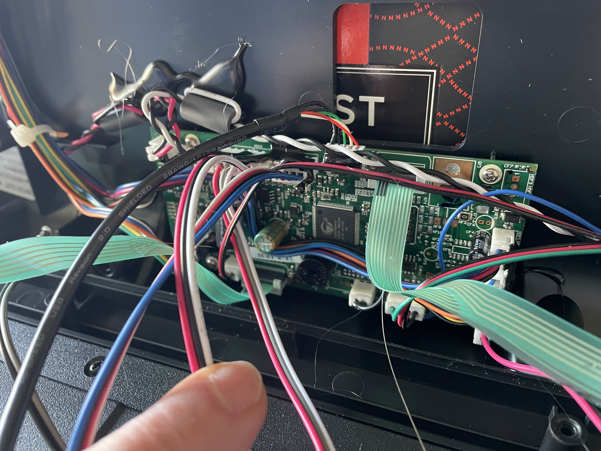
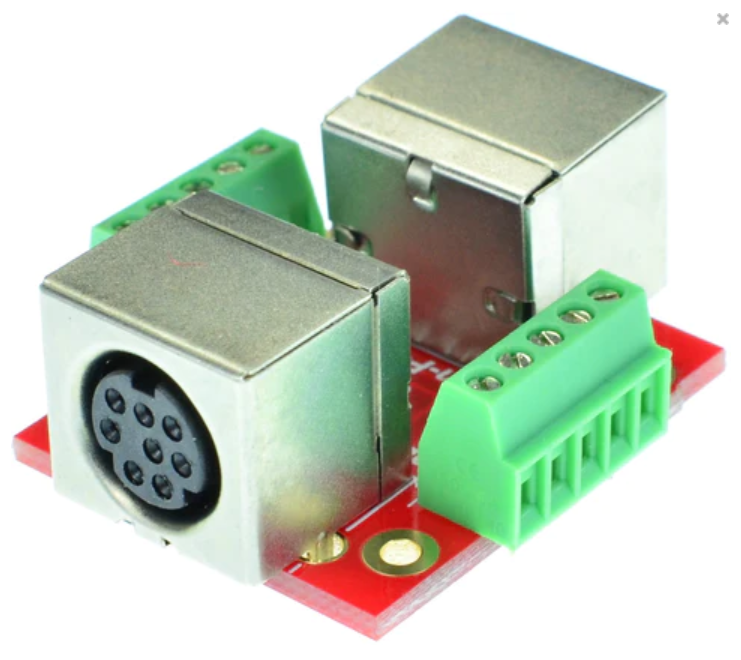
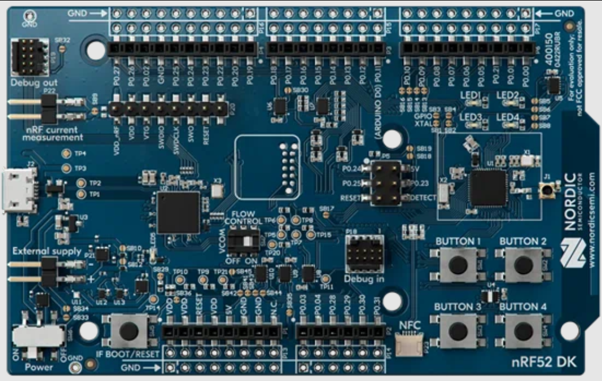

# Zwift-Enabled-NordicTrack-S15i
This project is intended to document my efforts to enable Zwift support on my NordicTrack S15i indoor bike.  The project was inspired by two documented efforts [Zwift working on Nordictrack s15i bike](https://www.reddit.com/r/nordictrack/comments/zcai3j/zwift_working_on_nordictrack_s15i_bike/) and [The transformation of my dumb home trainer to a smart Zwift trainer](https://github.com/ftmsemu/ftmsemu.github.io) to enable Zwift support on various indoor bike trainers.

## The Bike
The NordicTrack S15i is an internet-enabled bike, but it only works with iFit's online services - not Zwift.

The bike has a manual mode with incline and resistance adjustment, so use of the iFit service isn't required.  The bike also reports power and cadence on-screen - two things that [Zwift supports for compatibility](https://support.zwift.com/en_us/categories/gearing-up-for-your-first-ride-SJXnVwmDQ).

So... it seems the bike has all the prerequisites to be compatible with Zwift.  The question is whether I can fill in the gaps to make it compatible.

## First Steps
I started poking around the wiring on the bike to figure out where data is coming from and going to.  There are two connectors on the back of the S15i screen: RED and YELLOW

The yellow connector is a 6-pin mini DIN connector and the red connector is an 8-pin mini DIN connector. 

Unless some sort of wireless communication is going on, these are the only two connectors between the display and the rest of the bike.  That means the power, cadence, incline, resitance, and handlebar button controls must all go through these connectors.

A bit more tracing of the connectors indicates that the YELLOW connector goes ONLY to the handlebars, and the RED connector makes it's way down to the bit body itself.  This lead me to conclude the following...

The yellow connector must carry the handlebar button presses for
* Incline +/-
* Resitance +/-

The red connector must carry information FROM the bike regarding
* Cadence measurement
* Power measurement

and information TO the bike regarding
* Resistance setting
* Incline setting

### Yellow Connector Analysis

With the assumptions about each connector, I started my analysis with the yellow connector.  I disassembled the incline and resistance buttons on the handlebars to see if they were simple switches, or if there was a more complex circuit hiding there.  The buttons for incline +/- looked like this...

A bit of poking around with a digital multimeter on its continuty setting pretty much confirmed that these were simple switches.  In the case of the switch pictured here, the Black wire was common to both buttons, the Blue wire was for the incline -, and the Green wire was for the incline +.  Pressing either button basically creates a short between its corresponding wire and the black wire.

The resistance +/- buttons on the other side of the handlebars (not pictured) were similar, with Orange, Black/White, and Green corresponding to resistance +, common, and resistance - respectively.

Next, I wanted to figure out which pins of the yellow connector were connected to which control signal.

To do this, I used my DMM again to probe the 6 pins on the yellow connector while running through button presses on the 4 buttons.  Using the pin numbers on the diagram below, I concluded the following connections

1. Incline +
2. Incline common
3. Incline -
4. Resistance -
5. Resistance common
6. Resistance +
### Red Connector Analysis

Given the type of data that I assume is flowing through the red connector (cadence, power, incline, resistance), my guess is that the red connector's signal protocol is more complicated than that of simple switches.  My assumption (hope) is that the data for cadence, power, incline and resistance is being carried over a [standard serial interface](https://www.seeedstudio.com/blog/2019/09/25/uart-vs-i2c-vs-spi-communication-protocols-and-uses/) such as I2C, SPI or UART.  To determine the protocol, and eventually decode the data sent via the protocol, I'm going to need a [logic analyzer](https://en.wikipedia.org/wiki/Logic_analyzer) to monitor each of the 8 signals in the connector.

Monitoring these signals will need to be done **as the bike is being operated.**  This presents a little bit of a challenge as I'll need to maintain the connection of the red cable to the screen, while also trying to connect the logic analyzer to the signals in the red connector.

I popped the back panel off the bike's monitor, where the red and yellow connectors attach, to see if there were any convenient places to attach logic analyzer leads to the red connectors wires.

Unfortunately, there were no convenient places to attach logic analyzer leads to the red connector's wires.  At this point I decided that I would build my own 'breakout' board that will allow me to maintain the connectivity of the red connector to the bike's monitor, while also exposing the data lines in a way that is convenient for connection to a logic analyzer.

## The Breakout Board - Ordering
After looking around for a while, I found a site,  [eLabBay](https://elabbay.myshopify.com/collections/breadboard), with some really nice looking passthrough/breakout boards for both the 8-pin and 6-pin mini DIN connectors - as well as MANY others.  These boards will make my job a lot easier.

Although I don't need the 6-pin mini DIN passthrough/breakout to analyze the yellow connector signals, I will eventually need the passthrough for what I envision to be my final result - a device that I plug the yellow and red connects into, that will, in turn, have output cables that plug back into the bike's monitor.

I've placed my order with [eLabBay](https://elabbay.myshopify.com/collections/breadboard) and and eagerly awaiting delivery.  The total cost of the breakouts, including shipping, was $32.94.  I imagine I might be waiting a bit on these as I believe they are based in Hong Kong.

## Looking Ahead - Bluetooth Connectivity
While waiting for the breakout boards to arrive, I started thinking more about how I'll get the bike's cadence and power measurements to Zwift - and how I can get Zwift to control the bike's resistance and incline.  Zwift communicates to devices (sensors) using [ANT+ or Bluetooth Low Energy (BLE)](https://support.zwift.com/en_us/ant-and-ble-overview-B1S1BVgr).  Thanks to [The transformation of my dumb home trainer to a smart Zwift trainer](https://github.com/ftmsemu/ftmsemu.github.io), I found out about Nordic Semiconductor's [nRF52-DK](https://www.nordicsemi.com/Products/Development-hardware/nRF52-DK/) development kit. This inexpensive board, and it's associated software development kit (SDK) should give me everything I need to develop a BLE interface to the bike, once I decode the red connector's protocol.

I've place my order for the [nRF52-DK](https://www.nordicsemi.com/Products/Development-hardware/nRF52-DK/) with [Digi-Key](https://www.digikey.com/en/products/detail/nordic-semiconductor-asa/NRF52-DK/5773879) and expect deliver a bit sooner than the breakout boards.  The total cost for the development board, including shipping, was $48.72.